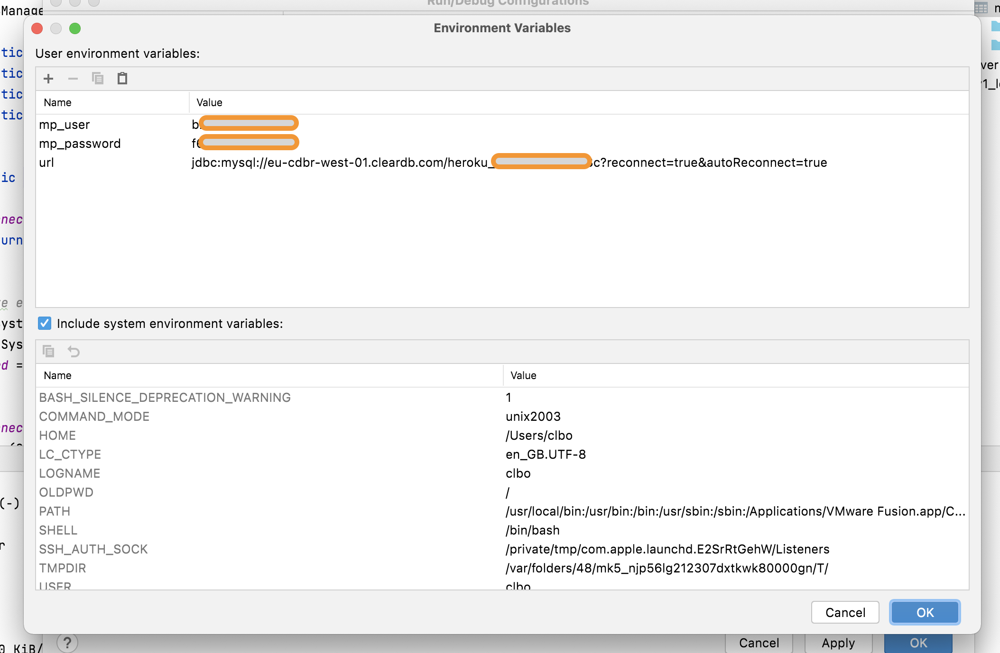
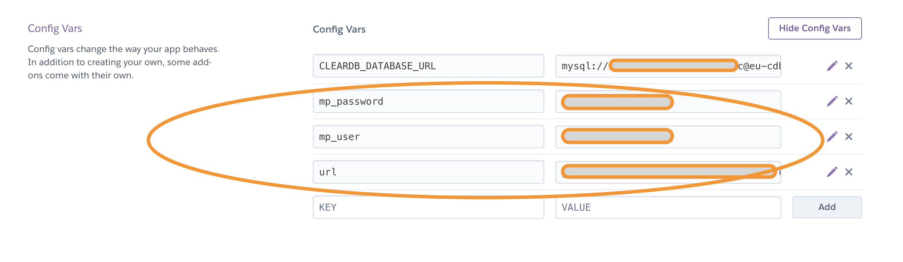

<!-- JS use if these pages are used as githubpages. can be deleted if used elsewhere -->
<script src="https://code.jquery.com/jquery-3.2.1.min.js"></script>
<script src="../script.js"></script> 

# Forbindelse til databasen gennem miljøvariabler
Indtil videre har i brugt jeres application.properties fil til at "holde" informationer vedrørende jeres database.

I denne tutorial skal lærer i hvordan i opsætter og bruger miljøvariabler istedet for application.properties metoden, som i har brugt indtil nu. 

## Problemet som vi gerne vil løse 
Når i skriver brugernavn og password ind i application.properties filen bliver i nød til at gøre denne fil tilgængelig for jeres applikation på Heroku. Det betyder at denne fil bliver nød til at ligge på Github (i hvert tilfælde når vi bruger den deployment metode som vi har brugt i undervisningen dette semester.).    

Problemet med denne metode er at alle i hele verden vil kunne se jeres brugernavn og password (da i sikkert bruger et public repository).    

### Private repository
En løsning er at gøre jeres github repository "private", men det kan give problemer i forhold til "colaborators" og andre der skal se jeres kode (feks. din lære).     

### Environment variabler (miljøvariabler)
En anden mere holdbar løsning er at slette indholdet i application.properties og så istedet skrive username og password et andet sted end i selve spring boot projektet. Dette kan gøres i din computers miljøvariabler (og i miiljøvariablerne på computeren hos Heroku).

Det følgende er en beskrivelse af hvordan du gør dette. 

## Lokalt på din egen computer

Åben din Spring Boot Web App i Intellij. Slet alt indhold i din application.properties fil. klik herefter på:

````
	Run -> Edit configurations -> Environment -> Environment Variables
```` 
Dette åbner en Gui som denne.    



Indtast de informationer vedrørende din database som du indtil nu har haft i din application.properties fil.     

### Ændring af DBManager fil
I din DBManager.java fil skal du ændre følgende kode.

Denne kodestump skal du slette:

````
	 try (InputStream input = new FileInputStream("src/main/resources/application.properties")) {
            Properties properties = new Properties();
            properties.load(input);
            url = properties.getProperty("url");
            user = properties.getProperty("user");
            password = properties.getProperty("password");
        } catch (IOException ex) {
            ex.printStackTrace();
        }
````

Og herefter ændre det til dette:    


````
	url = System.getenv("url"); 
        user = System.getenv("mp_user"); 
        password = System.getenv("mp_password"); 

````

Du kan se de 2 forskellige versioner af DBManager.java her:

* [Gammel version](https://github.com/techkea/movie-project/blob/appplication_propeties_version/src/main/java/dk/clbo/repository/dbconnect/DBManager.java)
* [Ny Version](https://github.com/techkea/movie-project/blob/master/src/main/java/dk/clbo/repository/dbconnect/DBManager.java)


## Environment Variables på Heroku

På Heroku under din apps adminpanel klik på:

````
	Settings -> Reveal Config Vars
````
Dette åbner dette vindue:



Udfyld felterne på samme måde som på din lokale computer.

Thats it!


