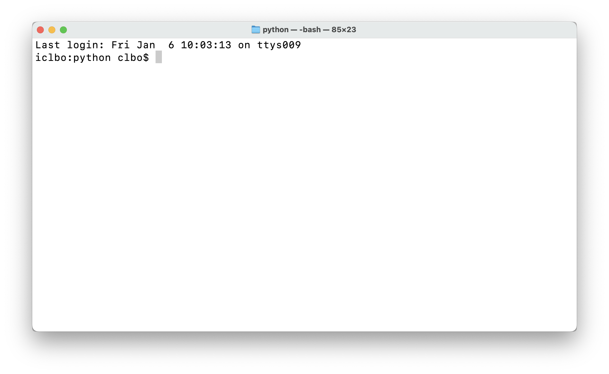
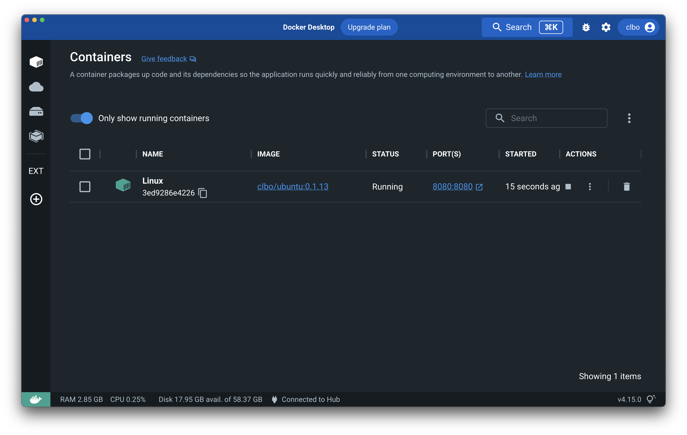
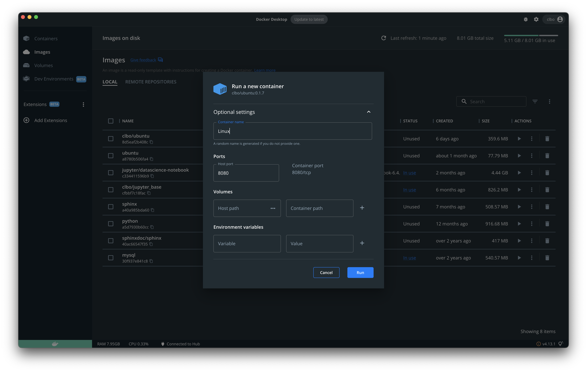
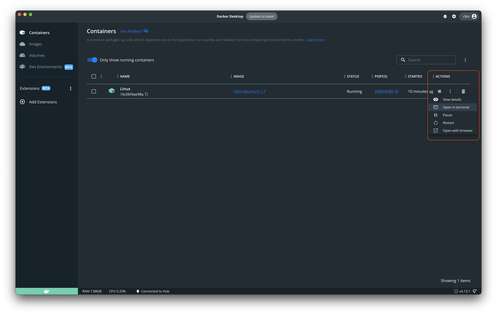
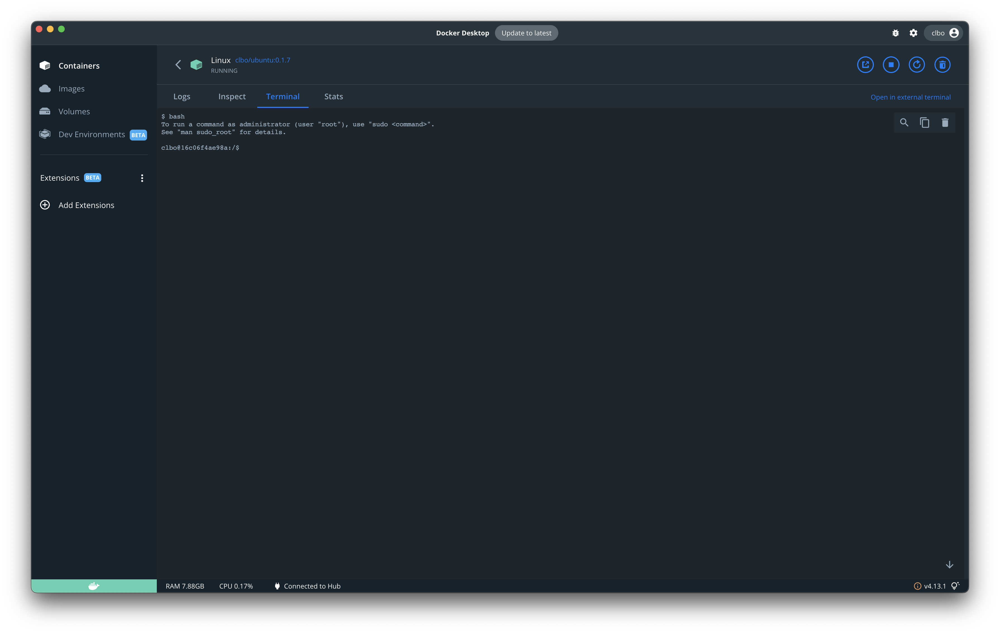
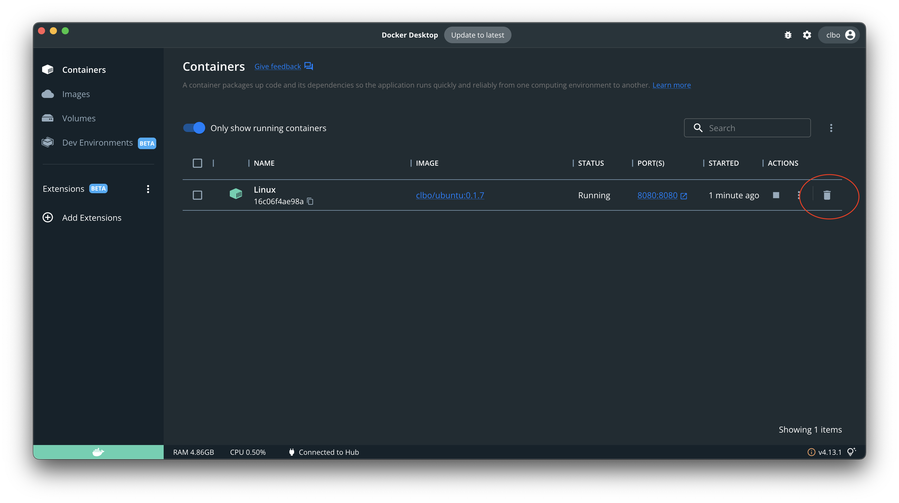

<!-- JS use if these pages are used as githubpages. can be deleted if used elsewhere -->
<script src="https://code.jquery.com/jquery-3.2.1.min.js"></script>
<script src="../script.js"></script> 

# Installationer
Herunder finder du en beskrivelse af hvad og hvordan du skal installere det software vi skal arbejde med i dag og resten af dette semester.


## 1. Docker Desktop
Det første du skal installere er programmet Docker Desktop. I første om gang kan du bare se dette program som en beholder som du så efterfølgende kan installere linux og andre programmer i. 

### Download og installer Docker Desktop
Naviger til **[Dockers website](https://www.docker.com/)** og download og installer Docker Desktop.

#### Windows Home 10
Hvis du skulle have Windows 10 Home på din computer skal du følge denne fremgangsmåde som er beskrevet her:
**[Install Docker Desktop on Windows Home](https://docs.docker.com/docker-for-windows/install-windows-home/)**

#### Check om alt er installeret korrekt
I din terminal, gitbash eller powershell skal du skrive ``` docker --version ```, hvilket skulle give dig følgende resultat:  

````
	$ docker --version
	Docker version 20.10.20, build 9fdeb9c
````
Versionsnummeret kan variere, men hvis du ikke kan se dette eller ser en fejl, har du ikke fået installeret Docker Desktop korrekt, og skal derfor gentage processen.


### Download og Kør dit linux OS

#### 1. Download    

Det næste du skal gøre er at downloade og køre et linux operativsystem inde i dette Docker program. Det linux OS vi kommer til at bruge hedder Ubuntu. Når du har gjort det har du installeret Linux på din egen maskine, side om side med enten windows eller macos. 

##### Windows
Hvis du har Windows på din computer skal du åbne programmet **PowerShell**. Dette gøres nemmest ved at skrive "Powershell" i søgefeltet nederst til venstre på skærmen. 


##### Mac
Hvis du har Mac skal du åbne programmet **Terminal**. Dette gøres nemmest ved at søge via **spotlight**.

 


Copy/paste herefter denne kommando i din terminal for at downloadie og starte Ubuntu (Linux):

````
	$ docker run -it -d --name Linux -p 8080:8080 clbo/ubuntu:1.0.0 
````

Det tager ca. et minuts tid og når det er sket skal du åbne **Docker desktop** og gå til **Containers** menupunktet.




<!-- 
#### 2. Start Linux

Under **Actions** i det image der hedder **clbo/ubuntu** skal du trykke på **start** knappen.    



Skriv **Linux** i **Container name** feltet og **8080** i **Host port** feltet og klik på **Run**



Under **Container** menupunktet klik på **Run in terminal** under **Actions**.    
Du har nu en **Terminal** som du kan bruge til at interagerer med dit linux OS.   



Som det første skriv ````bash```` og tryk på enter.    

<!--   
Efter Linux er downloadet og startet skulle du gerne se noget lignenede dette i din terminal: 

````
	$ docker run -it clbo/ubuntu:1.0.0
	To run a command as administrator (user "root"), use "sudo <command>".
	See "man sudo_root" for details.

	clbo@5743d5b63a70:/$ 	

````
-->    

Nu har du et linux operativsystem kørende på din computer og gennem din terminal har du mulighed for at interagere med (bruge) dette operativsystem.

### Åben terminalen i Linux
I højre side kan du ved at trykke på de 3 prikker vælge "Open in terminal". 


Dette åbner terminalen på din Linux computer, og du vil nu kunne arbejde med systemet. 

Docker desktop vil som udgangspunkt starte i **sh** terminalen så skriv **bash** og tryk på enter, og du skulle se noget der ligner dette:


### Start og stop din linux maskine
Når du fremover vil starte og stoppe din linux maskine kan du bruge Docker Desktops interface og under Actions henholdsvis trykke på start/stop knappen.


Du vil også under de tre prikker under Actions kunne åbne en terminal, hvorefter du er klar til at arbejde videre.

 


### Slet din Linux maskine
Hvis noget går galt med din linux installation, eller du bare har lyst til at starte forfra med en frisk installation, er det eneste du skal gøre bare at slette din installation og herefter gentage punkt **2. Start Linux**.





