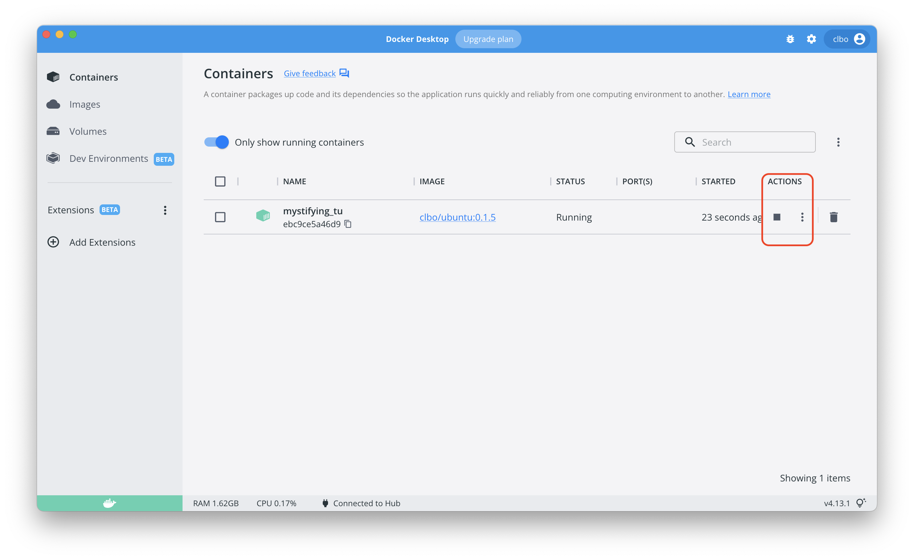

<!-- JS use if these pages are used as githubpages. can be deleted if used elsewhere -->
<script src="https://code.jquery.com/jquery-3.2.1.min.js"></script>
<script src="../script.js"></script> 

# Installationer
Herunder finder du en beskrivelse af hvad og hvordan du skal installere det software vi skal arbejde med i dag og resten af dette semester.


## 1. Docker Desktop
Det første du skal installere er programmet Docker Desktop. I første om gang kan du bare se dette program som en beholder som du så efterfølgende kan installere linux og andre programmer i. 

### Download og installer Docker Desktop
Naviger til [Dockers website](https://www.docker.com/) og download og installer Docker Desktop.

### Windows Home 10
Hvis du skulle have Windows 10 Home på din computer skal du følge denne fremgangsmåde som er beskrevet her:
[Install Docker Desktop on Windows Home](https://docs.docker.com/docker-for-windows/install-windows-home/)

#### Check om alt er installeret korrekt
I din terminal, gitbash eller powershell skal du skrive ``` docker --version ```, hvilket skulle give din følgende resultat:  

````
	$ docker --version
	Docker version 20.10.20, build 9fdeb9c
````
Versionsnummeret kan variere, men hvis du ikke kan se dette eller ser en fejl, har du ikke fåeet installeret Docker Desktop korrekt, og skal derfor gentage processen.


### Download, Installer og Kør din linux OS
Det første du skal gøre er at downloade og køre et linux operativsystem inde i dette Docker program. Det linux OS vi kommer til at bruge hedder Ubuntu.
 
Skriv denne kommando i din terminal for at download Ubuntu (Linux):

````
	$ docker pull clbo/ubuntu:1.0.0
````

Det tager et minuts tid og når det er sket skal du åbne Docker desktop.


<!--
Efter Linux er downloadet og startet skulle du gerne se noget lignenede dette i din terminal: 

````
	$ docker run -it clbo/ubuntu:1.0.0
	To run a command as administrator (user "root"), use "sudo <command>".
	See "man sudo_root" for details.

	clbo@5743d5b63a70:/$ 	

````
Nu har du et linux operativsystem kørende på sin computer og gennem din terminal har du mulighed for at interagere med (bruge) dette operativsystem.

### Start og stop din linux maskine
Når du fremover vil starte og stoppe din linux maskine kan du bruge Docker Desktops interface og under Actions henholdsvis trykke på start/stop knappen.



Du vil også under de tre prikker under Actions kunne åbne en terminal, hvorefter du er klar til at arbejde videre.

 


