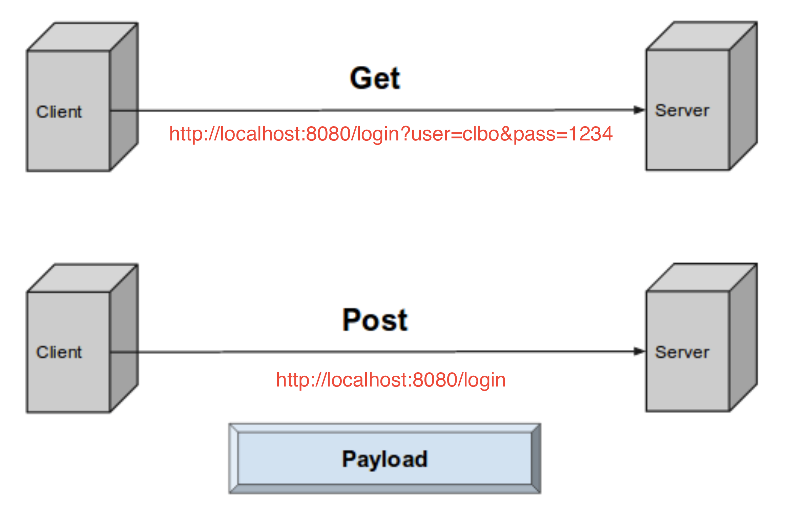
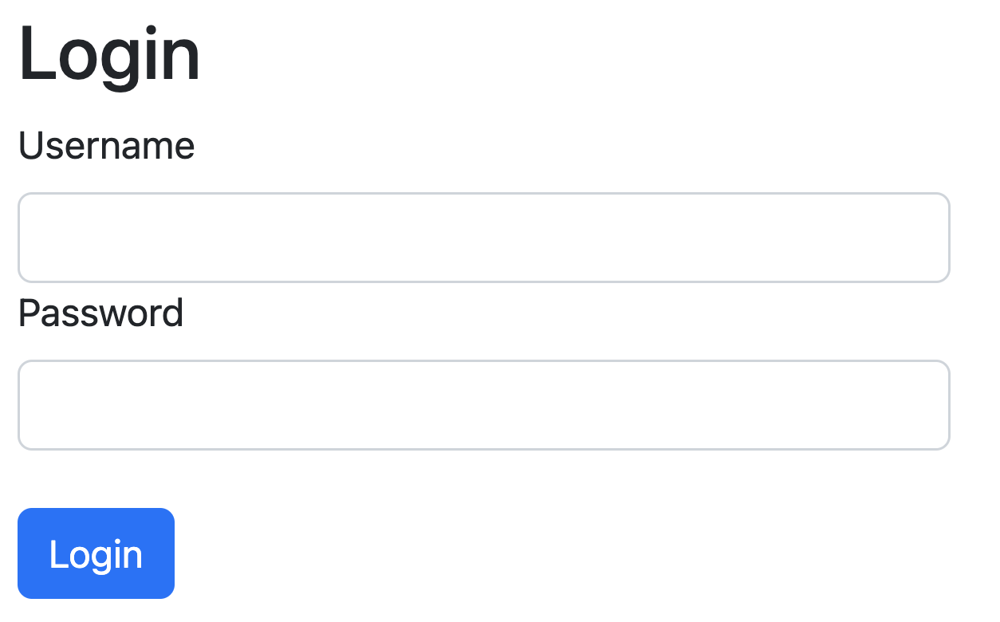
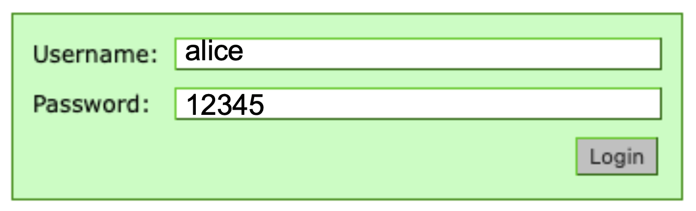
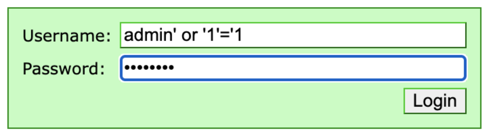
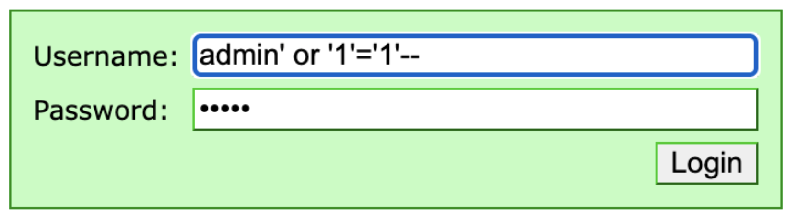
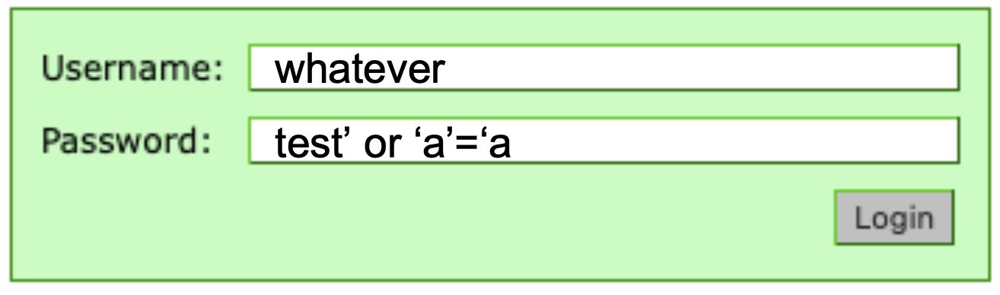

<!-- JS use if these pages are used as githubpages. can be deleted if used elsewhere -->
<script src="https://code.jquery.com/jquery-3.2.1.min.js"></script>
<script src="../script.js"></script> 

# SQL INJECTIONS

## HTTP get vs post


##
For at et SQLi attack kan være succesfuldt, bliver angriberen nød til at:
* Kende til det basale format/dialekt af den SQL sætning der bruges.
* have en eller anden ide om hvordan DB tabellerne er organinseret (navn på tabel, etc.)

Et godt gæt på en sql sætning tilhørende følgende login form kunne se sådan ud:



````
	SELECT * FROM users WHERE user='username’ AND pass='password’
	el.
	SELECT * FROM people WHERE username='username’ AND password='password’

````

Så hvis vi taster følgende ind i formen:



Kunne SQL sætningen komme til at se sådan ud:

````
	SELECT * FROM users WHERE user='alice' AND pass='12345'
````

## OR payload
I SQL (og de fleste andre sprog) vil **AND** returnere _True_ hvis begge betingelser er sande.     
**OR** vil returnere _True_ hvis bare an af betingelserne er sande. 

**AND** har envidere **forrang** (precedence) over **OR**    

Det kan vi benyttte os af ved at indtaste følgende i login formen. 



Hvilket giver følgenede SQL sætning:

````
	SELECT * FROM users WHERE user='admin' OR '1'='1' AND pass='test'
````
Sætningen bliver evalueret ved først at checke om user='admin' og pass='test'. Dette er ikke tilfælde, så det er False.    
Herefter checkes om user='admin' eller om 1=1. Dette er altid tilfældet da kun en af betingelserne behøver at være True (og 1 er altid lig 1).    

Læg også mærke til at det her er ligegyldigt om vi skriver det rigtige password og der er ligegyldigt om vi skriver det rigtigt brugernavn.

## Comment payload

Angriberen kan opgå gøre brug af ```--``` til at udkommentere kode. 



Hvilket giver følgende SQL sætning. 

````
	SELECT * FROM users WHERE user='admin' OR '1'='1'--' AND pass='test'
````
pass bliver ikke eksikveret da det er udkommenteret.     

## OR payload (på en ny måde)
En anden mulighed kunne være at skrive dette: 


Hvilket giver følgende SQL sætning. 

````
	SELECT * FROM users WHERE user='whatever' AND pass='test' OR 'a' = 'a'
````
Her returneres alt fra **users** hvis **user** er **whatever** og **pass** er **test** (hvilket jo nok aldrig vil passe) eller hvis user er **whatever** og password er **test** (hvilket nok heller ikke er tilfældet). Eller hvis **'a' = 'a'** (hvilket altid er tilfældet.)

## Hvordan sikre vi vores sites mod SQLi attackt


## Er dette overhodet et problem?


