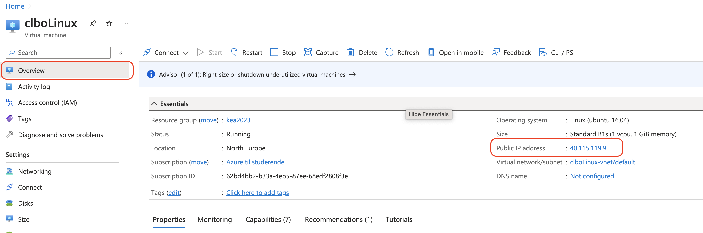
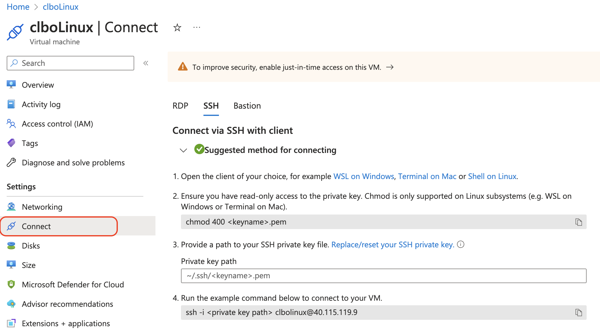

# Forbind via SSH til din Linux instans på Azure

For at forbinde til din linux maskine skal du først finde din public ip adresse:

Herefter skal du gøre følgende for at forbinde til din linux maskine gennem din terminal.

